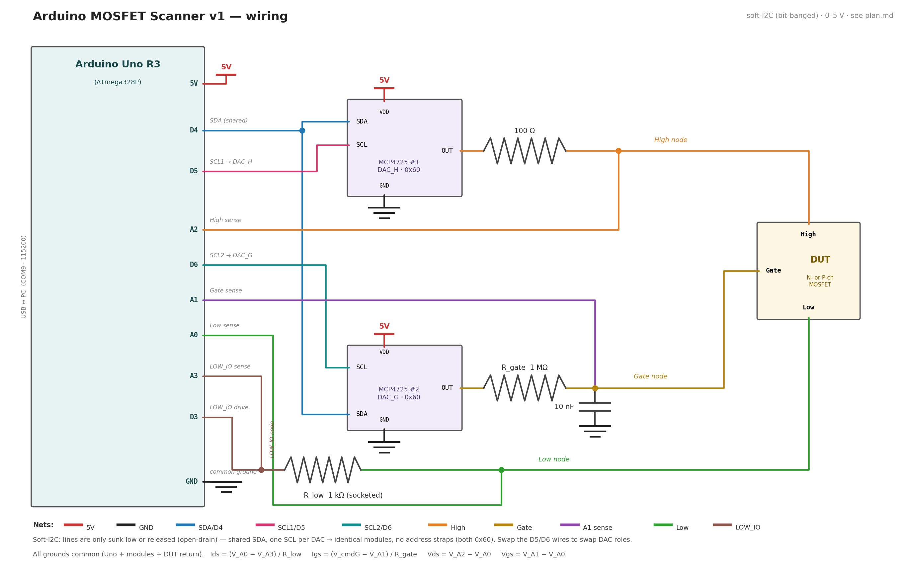

# Arduino MOSFET Scanner (v1, 0–5 V)

Arduino Uno R3 + 2× MCP4725 rig that answers "is this MOSFET viable for cascaded
digital logic?" — gate leakage plus Ids(Vds, Vgs) maps for positive and negative
gate voltages. Design rationale and v2 roadmap: [plan.md](plan.md).

```
firmware/mosfet_scanner/   Arduino sketch (no libraries beyond Wire/EEPROM)
firmware/build.ps1         compile / upload via arduino-cli
scan_arduino.py            test runner: 3-phase cycle -> CSVs + PNGs
```

## Wiring

I2C is bit-banged with a **shared SDA and one SCL line per DAC** — identical
modules need no address straps (both can be 0x60).


*(regenerate with `python wiring_diagram.py` after wiring changes)*

| From                | To                                  |
| ------------------- | ----------------------------------- |
| Uno D4              | SDA of **both** MCP4725s (shared)   |
| Uno D5              | SCL of the **DAC_H** module         |
| Uno D6              | SCL of the **DAC_G** module         |
| MCP4725 VDD / GND   | Uno 5V / GND (common with DUT)      |
| DAC_H OUT           | 100 Ω → **High** pin of DUT         |
| DAC_G OUT           | 1 MΩ (R_gate) → **Gate** pin        |
| DUT **Low** pin     | R_low (1 kΩ socketed) → **D3**      |
| A0                  | Low node (DUT side of R_low)        |
| A1                  | Gate pin node, plus **5–10 nF → GND** (5 nF fitted) |
| A2                  | High pin (DUT side of the 100 Ω)    |
| A3                  | D3 / LOW_IO side of R_low           |

Roles are physical: whichever module's SCL is on **D5 is DAC_H** — swap the
two SCL wires to swap roles. A 3rd DAC later = one more SCL pin (D2/D7).
Diagnostics if something doesn't ACK: `PINTEST` (per-line pullup/short/bridge
check), `SCAN?` (probe both buses), `RESCAN` after rewiring.

> Keep the Arduino IDE **Serial Monitor closed** while using this — it holds
> the COM port and `scan_arduino.py` can't open it.

## Firmware

```powershell
cd arduino-scanner\firmware
.\build.ps1                  # compile only
.\build.ps1 -Upload          # compile + upload (auto-detects the COM port)
```

## Python

```powershell
pip install pyserial numpy matplotlib
python scan_arduino.py --repl       # bring-up: talk to the firmware directly
python scan_arduino.py              # full 3-phase cycle, default steps
```

Useful flags: `--h-step/--g-step` (defaults 0.1 / 0.25 V → ~2–3 min per device;
go finer for parts that look interesting), `--rlow 10000` for low-current DUTs,
`--phases 23` to skip the leakage check, `--port COMx` if auto-detect fails.

## Bring-up checklist (first time)

**Guided:** `python bring-up.py` walks through everything interactively —
link → PINTEST → DAC comms → no-DUT self-test → jumper-wire functional tests
(High-Low = Ohm's-law current check, Gate-Low = Igs scale, Gate-High = A1/A2
agreement) → DMM calibration — with PASS/FAIL and wiring hints per step.
`python scan_arduino.py --selftest` reruns just the electrical check.

Manual equivalent:

1. **DACs**: upload, then `--repl`: `IDN?` shows both addresses. `SETH 2.500`,
   DMM on the High pin ≈ 2.5 V.
2. **Bandgap cal**: DMM on the Uno 5V pin, then
   `python scan_arduino.py --cal-vdd <reading>` (stores to MCU EEPROM).
3. **Safe cold boot**: in `--repl`, run `SAVEZERO` once (MCP4725s ship with
   2.5 V in EEPROM and replay it at power-up). *(Done 2026-06-10 for the two
   fitted DACs; redo if a module is replaced.)*
4. **Known resistor**: 4.7 kΩ as DUT High→Low. `SETH 5.0` → expect
   I ≈ 5/(4700+1000) ≈ **877 µA**, within 5 %. Sweep H → linear.
5. **Gate leak sanity**: 10 MΩ Gate→GND, `SETG 5.0` → Igs ≈ **0.45 µA**.
6. **Real MOSFET** (2N7000): full cycle; phase 2 should turn on near
   Vgs ≈ 2 V. Compare against the Siglent+Joulescope data for the same part.

## Output

Per phase: `scan-arduino-<ts>_phaseN.csv` + `.png`. Sweep CSVs start with the
legacy `Vds (V), Vgs (V), Ids (uA)` columns (commanded grid, so existing tools
can pivot), then measured values: `Igs (uA), Vds_meas, Vgs_meas, Vhigh, Vlow,
Vgate, Vlowio, flag` (`flag=clip` → even the 5 V-ref reading railed).

Signs: positive Ids = High→Low current; positive Igs = into the gate. Phase 3
(LOW_IO = 5 V) reports negative Vds/Vgs; on an N-channel DUT it mostly shows
the body diode. Igs is only meaningful to ~1 µA (deliberate v1 limit, ~5 µA
hard ceiling from R_gate).
